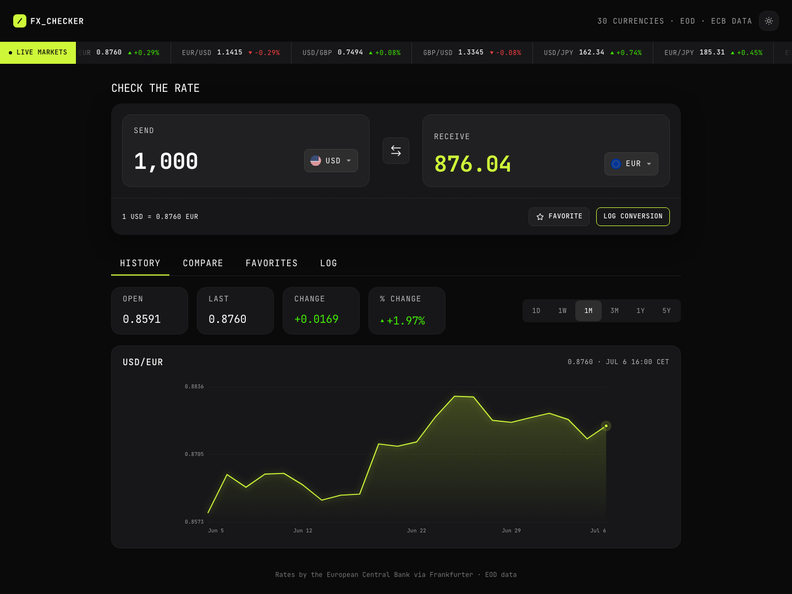

# Frontend Mentor - FX Checker solution

This is a solution to the [FX Checker challenge on Frontend Mentor](https://www.frontendmentor.io/challenges). Frontend Mentor challenges help you improve your coding skills by building realistic projects.


## Table of contents

- [Overview](#overview)
  - [The challenge](#the-challenge)
  - [Screenshot](#screenshot)
  - [Links](#links)
- [My process](#my-process)
  - [Built with](#built-with)
  - [What I learned](#what-i-learned)
  - [Continued development](#continued-development)
  - [Useful resources](#useful-resources)
- [Getting started](#getting-started)
  - [Install and run](#install-and-run)
  - [Testing](#testing)
  - [Project structure](#project-structure)
- [Accessibility](#accessibility)
- [Author](#author)

## Overview

### The challenge

Users should be able to:

- Convert an amount between any two of the ~30 currencies published by the European Central Bank, using live end-of-day rates from the [Frankfurter API](https://frankfurter.dev)
- Swap the send/receive currencies with one click
- See a live markets ticker with 24h changes for popular pairs
- Explore the rate history of the active pair on an interactive chart (1D · 1W · 1M · 3M · 1Y · 5Y) with open/last/change stats
- Compare the entered amount against every other currency at once
- Pin favorite pairs and load them back into the converter
- Keep a running log of conversions (persisted locally), with per-entry delete and clear-all
- Share or bookmark the active pair via URL query params (`?from=USD&to=EUR`)
- Use the whole app with the keyboard, on any viewport size (mobile, tablet, desktop), and in dark or light theme

### Screenshot



### Links

- Solution URL: [Add solution URL here](https://your-solution-url.com)
- Live Site URL: [Vercel Site](https://foreign-exchange-currency-converter-mocha.vercel.app/?from=USD&to=EUR)

## My process

### Built with

- [React 19](https://react.dev/) + [TypeScript](https://www.typescriptlang.org/) — strictly typed components and data layer
- [Vite](https://vite.dev/) — dev server and build
- [Tailwind CSS v4](https://tailwindcss.com/) — utility styling on top of CSS custom-property design tokens
- [Vitest](https://vitest.dev/) + [Testing Library](https://testing-library.com/) — unit and component tests
- Semantic HTML5 markup, CSS Grid and Flexbox, mobile-first responsive layout
- [Frankfurter](https://frankfurter.dev) — free, keyless API for ECB reference rates

No chart library: the rate-history chart is a hand-rolled responsive SVG that keeps its coordinate system at 1 unit = 1 CSS px (via `ResizeObserver`), so axis labels render at their true size on any viewport.

### What I learned

- **Design tokens as CSS variables + Tailwind v4 `@theme`** keep the palette in one place and make the light theme a pure variable override:

```css
@theme {
  --color-accent: var(--accent);
}
:root { --accent: #cef739; }
[data-theme="light"] { --accent: #a4c62a; }
```

- **Responsive SVG charts without a library** — matching the `viewBox` to the rendered size avoids letterboxed charts and unreadable, scaled-down axis text on mobile:

```tsx
const ro = new ResizeObserver(([entry]) => {
  const { width, height } = entry.contentRect
  if (width > 0 && height > 0) setSize({ w: width, h: height })
})
```

- **Deriving cross rates from a single base** (`rate(from→to) = rates[to] / rates[from]`) means one API call powers the converter, the ticker, and the compare panel.

### Continued development

- Offline caching of the last known rates (Service Worker)
- E2E coverage of the core convert → log flow with Playwright
- Extract the popover open/close/focus-return behaviour shared by the currency picker and the mobile tabs menu into a reusable hook

### Useful resources

- [Frankfurter API docs](https://frankfurter.dev) — clean, keyless ECB rates API
- [WAI-ARIA APG: Tabs pattern](https://www.w3.org/WAI/ARIA/apg/patterns/tabs/) — the roving-tabindex keyboard model used for the panel tabs
- [Tailwind CSS v4 theme variables](https://tailwindcss.com/docs/theme) — mapping design tokens into utilities

## Getting started

### Install and run

```bash
pnpm install
pnpm dev        # start the dev server
pnpm build      # type-check and build for production
pnpm preview    # preview the production build
pnpm lint       # run oxlint
```

### Testing

```bash
pnpm test         # run the Vitest suite once
pnpm test:watch   # watch mode
```

The suite covers the rate math (`crossRate`, `convert`, `change24h`), the formatting helpers (amount parsing/formatting, relative time, axis dates), and component behaviour (tabs keyboard navigation, mobile dropdown, delta rendering).

### Project structure

```
src/
├── components/   # UI components (Converter, RateChart, Tabs, panels…)
├── hooks/        # useMarketData (fetch + polling), useLocalStorage
├── lib/          # api client, pure rate math, formatting helpers, flags
├── types.ts      # shared domain types
└── index.css     # design tokens (Figma variables) + base styles
```

## Accessibility

- Landmarks (`header`, `main`, `footer`, labelled `section`s) and a logical heading hierarchy (`h1` → `h2` → `h3`)
- Programmatically associated labels on all form controls; live regions (`aria-live`) announce conversion results and favorites changes
- Full keyboard support: roving-tabindex tabs (arrow keys), searchable currency listbox (arrows/Enter/Escape), focus returned to the trigger when popovers close, and a keyboard-explorable chart (←/→, Home/End) that announces each data point via a live region
- Decorative icons and flags hidden from assistive tech; visible focus ring on every interactive element
- `prefers-reduced-motion` disables the ticker marquee and chart animations

## Author

- Frontend Mentor - [@AndJunes](https://www.frontendmentor.io/profile/AndJunes)
